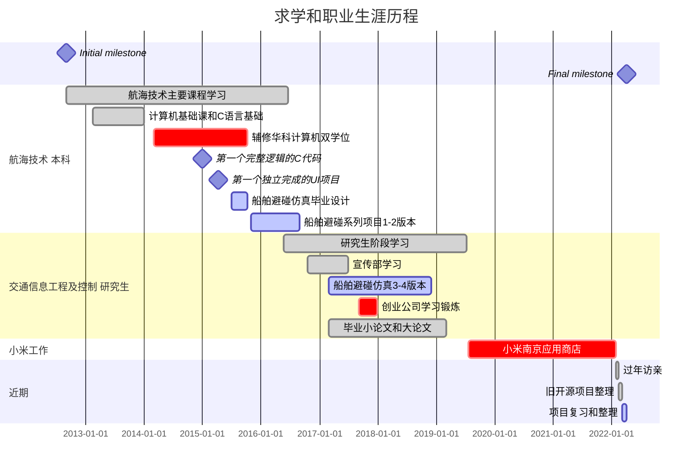

# 王玉龙 - 软件工程师 **:wave:** 

> :man:  1993 - ?  
> 最高学历 : 武汉理工大学 航运学院 交通信息工程及控制 硕士  
> 联系邮箱 : **wangyulong.eron@outlook.com**  
> 职业规划 : 软件工程师/全栈工程师/设计师  

- [领英LinkedIn](https://www.linkedin.com/in/naveron/)  
- [开源Github](https://github.com/NAVERON)  
- [博客园CNBlogs](https://www.cnblogs.com/eronnav/)  +  [Jekyll博客](https://naveron.github.io/)  

> 2014年初课程C语言基础和辅修双学位, 开始接触基础编程知识;  
> 2015年初完成第一个完整项目, 电话联系人管理(Java AWT, Swing), 学习C语言写的简单火车票购买程序(Command Line);  
> 2017年接触编程实习入门, 进入7人小公司打杂和学习;  
> 2019年硕士毕业进入小米(南京应用)工作, 2022年02月离职  
> 2022年过年期间访亲, 02月整理近两年学习所得并整理所有项目, 03月梳理知识点和备战找工作...  

# 职业经历 **:man_health_worker:** 

- **小米(2019.07 - 2022.02)** : 应用商店, 后端软件工程师, Java, Spring Boot, JSP, Shell, Python ...  
- **武汉创业公司(2017.09 - 2017.11)** : 7人小公司, 协助开发在线教育后台(基于[Edx](https://github.com/openedx/edx-platform)), Python 机器学习和爬虫, 技术选型等  
- **Java系列项目(2015.08 - 2019.04)** : JavaSwing/JavaFx 桌面客户端, 船舶仿真系列软件, 小工具项目(自己的练习项目)  

# 教育基础 **:man_student:** 

1. 武汉理工大学 航运学院 | 交通信息工程及控制 硕士  
    - 起止时间 : 2016.09 - 2019.07  
    - 主要研究方向 : 船舶避碰仿真软件, 树莓派简单使用, 避碰规则的研究  
    - 主要课程 : 水上交通建模与仿真，数学模型，第一外国语(英)，船舶控制理论与技术，船舶交通流实验等  
    - 参与的活动 : 担任校研会宣传部干事，多次参与海报制作，出色完成任务  

2. 武汉理工大学 航运学院 | 航海技术 学士  
    - 起止时间 : 2012.09 - 2016.09  
    - 主要课程 : 船舶原理，航海学（地文+天文），船舶操纵与海上搜救等  
    - 获奖情况 : 成绩良好获得学校二等奖学金，评选为优秀学生干部、优秀毕业生、课外培养优秀学生  

3. 华中科技大学 计算机科学与技术 | 本科辅修双学位  
    - 起止时间 : 2014.03 - 2015.10  
    - 主要课程 : 离散数学，数据结构，操作系统，编译原理, 软件工程等  
    - 参与的实验课程 : 数模, 汇编实验课  

# 技术积累和项目经验 **:desktop_computer:** 

### 1. Java Spring Boot | 应用自动化测试和审核后台管理系统  

> **技术栈** : Java Spring Boot, Redis, Zookeeper, RPC(Remote Procedure Call), MQ(Message Queue), JSP(Java Server Page), Mysql  

- 手机应用自动化测试, 实现自动调度拉取开发者提交的应用, 并进行兼容性测试, 病毒安全测试, GPP(Google Play Protect)测试, 第三方SDK检测, 同时保障测试速度和进展监控.  
- 兼容性标签后台管理系统的功能优化, 通过假删除+数据比对实现标签前后变化的完整记录, 同时采用分页查询和条件优化的方法提高搜索效率.  
- 风险应用库完整开发实践, 后台审核需求改进和bugfix等需求  
- 汇总目前所学, 设想船舶管理和轨迹生成的场景, 针对性的练习Spring Boot框架, 完成基础功能 : [PracticeSpringboot](https://github.com/NAVERON/PracticeSpringboot) + [PracticeJavaFx](https://github.com/NAVERON/PracticeJavaFx)  

### 2. JavaFx Python | 船舶避碰仿真软件和机器学习的应用  

> **技术栈** : Java Swing, JavaFx, FXGL, Python PyTorch  

- 从毕业设计的船舶避碰开始, 解决存在线程刷新冲突问题, 并逐步增加交互对象创建, socket通信, [定制化UI组件](https://github.com/NAVERON/ArbitraryCoding/tree/main/src/main/java/com/eron/routeplanning)和应用JavaFx, 实现船舶避碰4个版本, [持续优化中](https://github.com/NAVERON/ShipSimulation)...  
- 使用JavaFx优化[仿真框架](https://github.com/NAVERON/ArbitraryCoding/tree/main/src/main/java/com/eron/simulationframe), 制作[日报记录提交小工具](https://github.com/NAVERON/ArbitraryCoding/tree/main/src/main/java/com/eron/attendance), 校园招聘关键词[搜索工具](https://github.com/NAVERON/ArbitraryCoding/tree/main/src/main/java/com/eron/crawljobs)  
- 1个月完成Q-Learning算法应用到船舶避碰中, 了解基础的理论, 能够调整参数和修改计算逻辑达到避碰仿真应用的目的  

